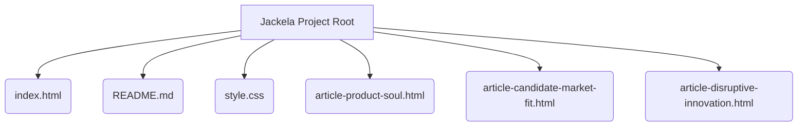

## 项目概述
本次更新旨在将个人项目打造成一个多层次、相互印证的“思想根据地”。通过在GitHub Pages上部署个人博客首页和独立文章页面，以及在GitHub Profile的README中引导流量，系统地展示个人思考与探索。

## 项目结构


## 核心组件与逻辑
*   `index.html`: GitHub Pages的主页，现已改造为个人博客首页，在保留原有“我的项目”部分的基础上，新增了文章摘要及链接，并填充了“关于我”部分的具体内容。
*   `README.md`: GitHub Profile的入口，新增“我的思考与探索”栏目，引导用户访问GitHub Pages上的文章。
*   `article-product-soul.html`, `article-candidate-market-fit.html`, `article-disruptive-innovation.html`: 三篇独立文章的HTML页面，承载深度内容。
*   `style.css`: 样式文件，用于统一页面风格。

## 交互与数据流
```mermaid
graph TD
    User[用户] -->|访问| GitHubProfile[GitHub Profile (README.md)];
    GitHubProfile -->|点击文章链接| GitHubPages[GitHub Pages (index.html)];
    GitHubPages -->|浏览文章摘要| ArticleSummary[文章摘要];
    ArticleSummary -->|点击“阅读全文”| ArticlePage[独立文章页面 (e.g., article-product-soul.html)];
```