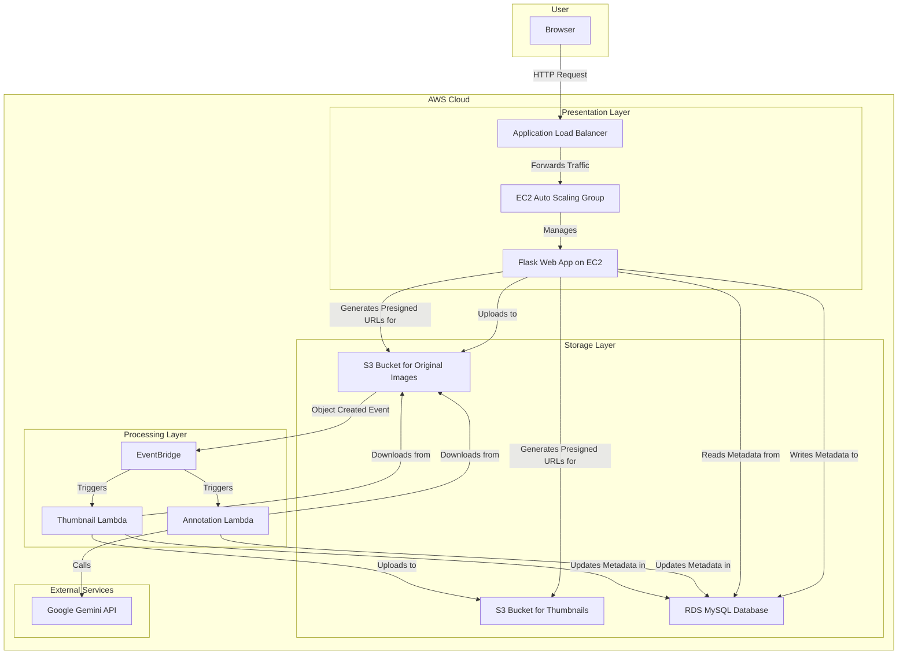

# 孔维轩 (Weixuan Kong) - 个人作品集

你好！我是一名对技术充满热情、追求全面发展的复合型工程师。我相信最卓越的产品诞生于技术深度与人文关怀的交汇点。我拥有扎实的计算机科学背景与前瞻的产品架构思维，热衷于构建高可用、可扩展且能解决实际问题的软件系统。

*   **邮箱:** `Jackkong29@Gmail.com`
*   **GitHub:** `github.com/Jackela`

---

### 核心技能 (Core Competencies)

| 类别 | 技能 |
| :--- | :--- |
| **编程语言** | `Java`, `Python`, `JavaScript/TypeScript`, `C#`, `SQL` |
| **框架 & 库** | `FastAPI`, `Spring Boot`, `React`, `NestJS`, `Node.js`, `Next.js`, `PyTorch`, `LlamaIndex`, `Haystack`, `Langchain4j` |
| **数据库** | `MySQL`, `PostgreSQL`, `MongoDB`, `SQLite`, `DynamoDB`, `Milvus` |
| **云原生 & DevOps** | `AWS (Lambda, S3, EventBridge, CloudFormation)`, `Docker`, `Kubernetes`, `Git`, `CI/CD (GitHub Actions)` |
| **架构 & 方法论** | `领域驱动设计 (DDD)`, `微服务架构`, `事件驱动架构`, `Saga 模式`, `RAG`, `Serverless`, `配置驱动设计`, `SOLID` |

---

### 精选项目经历 (Featured Projects)

#### 1. AI 增强的 PDF 学术工具 (AI Enhanced PDF Scholar)
    

**一个生产级的智能学术文献管理平台，利用 RAG 技术增强 PDF (含扫描版) 的阅读、查询和分析体验。**

[**➡️ 查看 GitHub 仓库**](https://github.com/Jackela/ai_enhanced_pdf_scholar)

*   **智能问答与分析:** 基于 `LlamaIndex` 和 `Gemini API` 构建了复杂文档的问答引擎，支持对 PDF 内容进行深度语义查询和摘要生成。
*   **生产级工程实践:**
    *   **完全容器化:** 使用 `Docker` 和 `Docker Compose` 精心编排了独立的开发、测试与生产环境。生产环境采用 `Nginx` + `Gunicorn` + `Uvicorn` 的高性能部署方案。
    *   **全面的自动化测试:** 项目拥有超过 75% 的代码覆盖率，集成了单元测试、集成测试和端到端（E2E）测试，并通过 `GitHub Actions` 实现 CI/CD，确保代码质量。
*   **技术栈:** `Python`, `FastAPI`, `LlamaIndex`, `Gemini API`, `PyMuPDF`, `Docker`, `Nginx`, `GitHub Actions`。

#### 2. AI 招聘文员 (AI Recruitment Clerk)
    

**一个由 AI 驱动的自动化招聘辅助平台，通过微服务架构和 RAG 技术提升简历筛选和人岗匹配的效率与精准度。**

[**➡️ 查看 GitHub 仓库**](https://github.com/Jackela/AI-Recruitment-Clerk)

*   **微服务架构设计:**
    *   系统被清晰地拆分为五个核心微服务：`API 网关`、`简历解析服务`、`JD 提取服务`、`人岗匹配评分引擎` 和 `分析报告生成服务`。
    *   服务间通过 `NATS` 消息队列进行异步通信，实现了高内聚、低耦合的系统设计，确保了系统的可扩展性和容错性。
*   **技术栈:** `TypeScript`, `NestJS`, `Angular`, `MongoDB`, `NATS`, `Docker`, `Gemini API`。

#### 3. Novel-Engine (多智能体互动小说生成器)
 

**一个基于《战锤 40K》宇宙的多智能体 AI 叙事模拟系统，通过智能体协作动态生成战役叙事。**

[**➡️ 查看 GitHub 仓库**](https://github.com/Jackela/Novel-Engine)

*   **多智能体协作系统:** 设计并实现了 `System Orchestrator` (导演智能体)，负责驱动故事发展、管理场景和协调其他智能体。
*   **分层记忆与缓存协议:** 为智能体设计了复杂的分层记忆系统（包含工作记忆、情景记忆、语义记忆），并通过高效的内存查询引擎和缓存机制（即简历中提到的“神圣缓存协议”），显著优化了性能。
*   **技术栈:** `Python`, `Gemini API`, `Pydantic`, `Loguru`。

#### 4. CAPSTONE：临时学术人员工时管理系统
   

**旨在解决高校临时学术人员工时管理及财务审计痛点的数字化系统，我在其中独立承担产品负责人与架构师角色。**

*(该项目为私有仓库)*

*   **架构设计:** 采用 **“模块化单体”** 架构，项目包结构严格遵循 **领域驱动设计 (DDD)** 思想，划分为 `domain`, `infrastructure`, `api` 等多个层，展现了清晰的六边形架构理念。
*   **产品规划:** 采用 `MoSCoW` 方法对需求进行优先级排序，定义了 MVP (最小可行产品) 的核心功能。
*   **技术栈:** `Java`, `Spring Boot`, `DDD`, `PostgreSQL`, `Thymeleaf`。

#### 5. 云原生 AI 影像标注系统
   

**一个为大规模 AI 影像标注任务设计的事件驱动、无服务器 (Serverless) 系统，可将处理时延降低 82%。**

[**➡️ 查看 GitHub 仓库**](https://github.com/Jackela/COMP5349)

*   **事件驱动与 Serverless 架构:** 核心流程由 `AWS S3` 的对象创建事件触发，通过 `EventBridge` 将任务分发给并行的 `AWS Lambda` 函数，实现了高效的异步处理。
*   **基础设施即代码 (IaC):** 使用 `AWS CloudFormation` 将整个云基础设施进行模块化、代码化管理，将复杂的云环境配置时间从数小时缩短至 15 分钟。

  
点击查看架构图

*   **技术栈:** `Python`, `Flask`, `AWS (S3, Lambda, EventBridge, RDS, EC2, CloudFormation)`, `Docker`。

#### 6. 分布式医疗微服务系统
  

**一个基于 AWS Serverless 构建的 AI 医疗微服务系统，作为 Agile 项目经理和核心后端开发者参与。**

[**➡️ 查看 GitHub 仓库**](https://github.com/Jackela/ELEC5620-Doctor-Service)

*   **Serverless 微服务:** 系统被拆分为 `Doctor` 和 `Patient` 两个核心服务，每个服务都是一个独立的 `AWS Lambda` 函数，遵循“单一职责”和“数据库-每-服务”的设计模式。
*   **AI 功能集成:** 使用 `Langchain4j` 框架集成大语言模型，为系统提供智能问诊或病历分析等 AI 功能。
*   **技术栈:** `Java`, `AWS Lambda`, `Langchain4j`, `API Gateway`, `DynamoDB`。

#### 7. 分布式商店平台 (Saga 模式实现)
   

**一个基于微服务架构的全栈电子商务平台，为解决分布式事务问题，深入研究并手动实现了 Saga 模式。**

[**➡️ 查看 GitHub 仓库**](https://github.com/Jackela/sydney-comp5348-group-project-showcase)

*   **分布式事务解决方案:** 为解决下单、扣减库存、更新订单状态等跨服务操作的原子性问题，设计并实现了一套完整的 **Saga 编排**流程，确保了关键业务场景下跨服务的数据最终一致性。
*   **高性能微服务集群:** 后端采用 `Java Spring Boot` 构建微服务集群，服务间通过 `gRPC` 进行高性能、低延迟的二进制通信。
*   **技术栈:** `Java`, `Spring Boot`, `gRPC`, `Saga Pattern`, `Next.js`, `TypeScript`, `Docker`。

#### 8. 深度学习文本分类框架
  

**一个精确复现顶级论文 (VDCNN, DenseNet) 成果，并重构为一个生产级的、配置驱动的文本分类实验框架。**

[**➡️ 查看 GitHub 仓库**](https://github.com/Jackela/Project5)

*   **配置驱动设计:** 采用“配置即代码”思想，通过 `YAML` 文件来驱动整个实验流程，实现了代码与实验配置的完全分离，保证了研究的可复现性。
*   **高扩展性架构:** 严格遵循 `SOLID` 原则和工厂模式，将数据处理、模型定义、训练循环等模块高度解耦，支持快速实验。
*   **技术栈:** `Python`, `PyTorch`, `YAML`, `Scikit-learn`, `Pandas`。

---

### 关于我 (About Me)
我是一名追求全面发展的复合型工程师，拥有扎实的计算机科学背景与前瞻的产品架构思维，并坚信最卓越的产品诞生于技术深度与人文关怀的交汇点。我的思维模型受益于长期且跨学科的系统性阅读（自 2019 年以来投入超 3300 小时，阅读 863 本书籍），这让我构建了以计算机科学为深度、人文社科为广度的“T 型知识结构”，使我能从第一性原理理解技术，更能洞察用户和商业的本质，在复杂问题中找到创新的解决方案。我渴望能加入一个顶尖的团队，将我对技术的热情、对产品的好奇心和跨学科的思考力相结合，共同打造能为用户和社会创造巨大价值的产品。