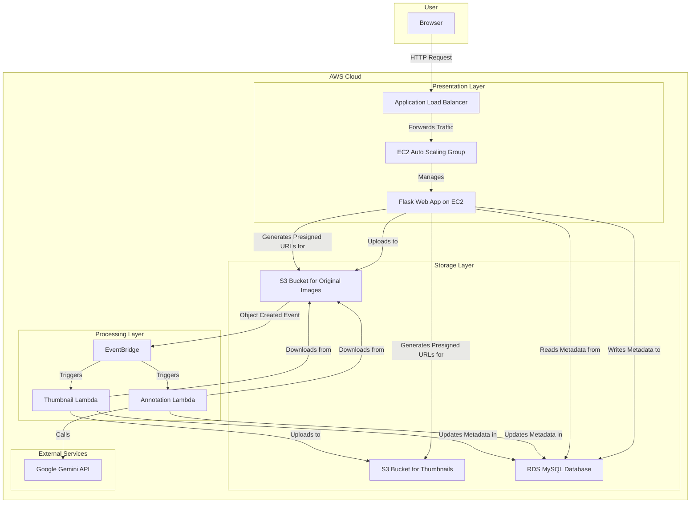

# Weixuan Kong - Personal Portfolio

Hello! I am a multifaceted and passionate engineer with a firm belief that the most exceptional products are born at the intersection of deep technical expertise and a human-centric perspective. I possess a strong foundation in computer science and a forward-thinking approach to product architecture, with a passion for building highly available, scalable, and impactful software systems.

*   **Email:** `Jackkong29@Gmail.com`
*   **GitHub:** `github.com/Jackela`

---

### Core Competencies

| Category | Skills |
| :--- | :--- |
| **Programming Languages** | `Java`, `Python`, `JavaScript/TypeScript`, `C#`, `SQL` |
| **Frameworks & Libraries** | `FastAPI`, `Spring Boot`, `React`, `NestJS`, `Node.js`, `Next.js`, `PyTorch`, `LlamaIndex`, `Haystack`, `Langchain4j` |
| **Databases** | `MySQL`, `PostgreSQL`, `MongoDB`, `SQLite`, `DynamoDB`, `Milvus` |
| **Cloud-Native & DevOps** | `AWS (Lambda, S3, EventBridge, CloudFormation)`, `Docker`, `Kubernetes`, `Git`, `CI/CD (GitHub Actions)` |
| **Architecture & Methodologies** | `Domain-Driven Design (DDD)`, `Microservices`, `Event-Driven Architecture`, `Saga Pattern`, `RAG`, `Serverless`, `Configuration-Driven Design`, `SOLID` |

---

### Featured Projects

#### 1. AI Enhanced PDF Scholar
    

**A production-grade, intelligent academic document management platform that enhances the experience of reading, querying, and analyzing PDFs (including scanned versions) using RAG technology.**

[**➡️ View on GitHub**](https://github.com/Jackela/ai_enhanced_pdf_scholar)

*   **Intelligent Q&A and Analysis:** Built a sophisticated document Q&A engine using `LlamaIndex` and the `Gemini API` to support deep semantic queries and summary generation for complex PDF content.
*   **Production-Grade Engineering Practices:**
    *   **Fully Containerized:** Meticulously orchestrated separate development, testing, and production environments using `Docker` and `Docker Compose`. The production environment utilizes a high-performance `Nginx` + `Gunicorn` + `Uvicorn` deployment stack.
    *   **Comprehensive Automated Testing:** Achieved over 75% code coverage with a suite of unit, integration, and end-to-end (E2E) tests. CI/CD is implemented via `GitHub Actions` to ensure code quality.
*   **Tech Stack:** `Python`, `FastAPI`, `LlamaIndex`, `Gemini API`, `PyMuPDF`, `Docker`, `Nginx`, `GitHub Actions`.

#### 2. AI Recruitment Clerk
    

**An AI-driven, automated recruitment assistance platform that improves the efficiency and accuracy of resume screening and job matching through a microservices architecture and RAG technology.**

[**➡️ View on GitHub**](https://github.com/Jackela/AI-Recruitment-Clerk)

*   **Microservices Architecture Design:**
    *   The system is cleanly decoupled into five core microservices: an `API Gateway`, `Resume Parser Service`, `JD Extractor Service`, `Candidate Scoring Engine`, and `Analytics Report Generator`.
    *   Services communicate asynchronously via a `NATS` message queue, achieving a high-cohesion, low-coupling design that ensures system scalability and fault tolerance.
*   **Tech Stack:** `TypeScript`, `NestJS`, `Angular`, `MongoDB`, `NATS`, `Docker`, `Gemini API`.

#### 3. Novel-Engine (Multi-Agent Interactive Fiction Generator)
 

**A multi-agent AI narrative simulation system based on the Warhammer 40K universe that generates dynamic campaign narratives through agent collaboration.**

[**➡️ View on GitHub**](https://github.com/Jackela/Novel-Engine)

*   **Multi-Agent Collaborative System:** Designed and implemented a `System Orchestrator` (the "Director" agent) responsible for driving the story, managing scenes, and coordinating other agents.
*   **Layered Memory & Caching Protocol:** Engineered a sophisticated layered memory system for agents (including working, episodic, and semantic memory) and significantly optimized performance via an efficient query engine and caching mechanism (the "Sacred Cache Protocol" from the resume).
*   **Tech Stack:** `Python`, `Gemini API`, `Pydantic`, `Loguru`.

#### 4. CAPSTONE: Casual Academic Time Allocation Management System
   

**A digital system designed to solve the pain points of timesheet management and financial auditing for casual academic staff at universities, for which I served as both Product Owner and Architect.**

*(This project is in a private repository)*

*   **Architectural Design:** Adopted a **"Modular Monolith"** architecture, with the project's package structure strictly following **Domain-Driven Design (DDD)** principles into layers like `domain`, `infrastructure`, and `api`, demonstrating a clean, hexagonal architecture.
*   **Product Planning:** Utilized the `MoSCoW` method to prioritize requirements and define the MVP's core features.
*   **Tech Stack:** `Java`, `Spring Boot`, `DDD`, `PostgreSQL`, `Thymeleaf`.

#### 5. Cloud-Native AI Image Annotation System
   

**An event-driven, serverless system designed for large-scale AI image annotation tasks, which successfully reduced processing latency by 82%.**

[**➡️ View on GitHub**](https://github.com/Jackela/COMP5349)

*   **Event-Driven & Serverless Architecture:** The core workflow is triggered by `AWS S3` object creation events and routed via `EventBridge` to parallel `AWS Lambda` functions, enabling highly efficient asynchronous processing.
*   **Infrastructure as Code (IaC):** Managed the entire cloud infrastructure using modular `AWS CloudFormation` templates, reducing complex environment configuration time from hours to just 15 minutes.

  
Click to view Architecture Diagram

*   **Tech Stack:** `Python`, `Flask`, `AWS (S3, Lambda, EventBridge, RDS, EC2, CloudFormation)`, `Docker`.

#### 6. Distributed Medical Microservices System
  

**An AI-powered medical microservices system built on AWS Serverless, where I contributed as an Agile Project Manager and Core Backend Developer.**

[**➡️ View on GitHub**](https://github.com/Jackela/ELEC5620-Doctor-Service)

*   **Serverless Microservices:** The system was split into `Doctor` and `Patient` services, each implemented as an independent `AWS Lambda` function, adhering to the "Single Responsibility" and "Database-per-Service" design patterns.
*   **AI Integration:** Integrated large language models using the `Langchain4j` framework to provide the system with intelligent features like AI-assisted diagnostics.
*   **Tech Stack:** `Java`, `AWS Lambda`, `Langchain4j`, `API Gateway`, `DynamoDB`.

#### 7. Distributed Store Platform (Saga Pattern Implementation)
   

**A full-stack e-commerce platform based on a microservices architecture, for which I researched and manually implemented the Saga pattern to solve distributed transaction challenges.**

[**➡️ View on GitHub**](https://github.com/Jackela/sydney-comp5348-group-project-showcase)

*   **Distributed Transaction Solution:** Designed and implemented a complete **Saga orchestration** flow to ensure atomicity for cross-service operations, guaranteeing eventual consistency for critical business scenarios.
*   **High-Performance Microservices Cluster:** The backend was built with a `Java Spring Boot` microservices cluster, with services communicating via high-performance, low-latency binary `gRPC` calls.
*   **Tech Stack:** `Java`, `Spring Boot`, `gRPC`, `Saga Pattern`, `Next.js`, `TypeScript`, `Docker`.

#### 8. Deep Learning Text Classification Framework
  

**A production-grade, configuration-driven text classification framework that accurately reproduces the results of top-tier academic papers (VDCNN, DenseNet).**

[**➡️ View on GitHub**](https://github.com/Jackela/Project5)

*   **Configuration-Driven Design:** Adopted a "configuration-as-code" philosophy, using `YAML` files to drive the entire experimental workflow, which decouples code from experiment configuration and ensures high reproducibility.
*   **Highly Extensible Architecture:** Strictly adhered to `SOLID` principles and the Factory pattern to highly decouple data processing, model definition, and training loop modules, allowing for rapid extension.
*   **Tech Stack:** `Python`, `PyTorch`, `YAML`, `Scikit-learn`, `Pandas`.

---

### About Me
I am a multifaceted engineer with a strong background in computer science and a forward-thinking approach to product architecture, driven by the belief that the best products arise from the convergence of technical depth and human-centric empathy. My mental models are shaped by extensive and interdisciplinary systematic reading (over 3300 hours and 863 books since 2019), which has allowed me to build a "T-shaped" knowledge structure with depth in computer science and breadth in the humanities and social sciences. This enables me to understand technology from first principles and, more importantly, to grasp the essence of user and business needs to find innovative solutions to complex problems. I am eager to join a top-tier team where I can combine my passion for technology, curiosity for products, and interdisciplinary thinking to create products that deliver immense value to users and society.
